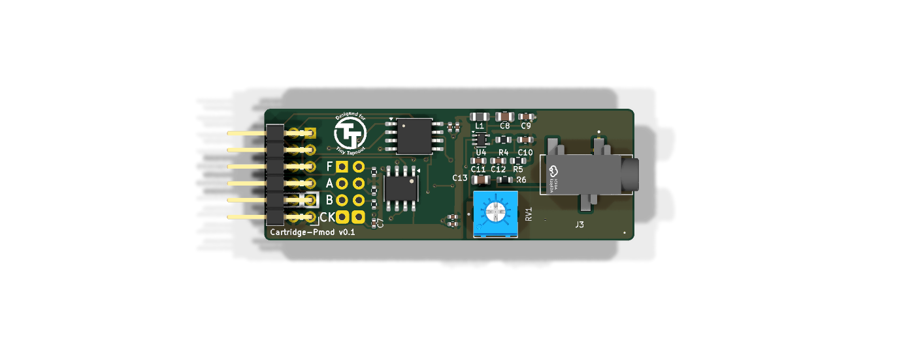
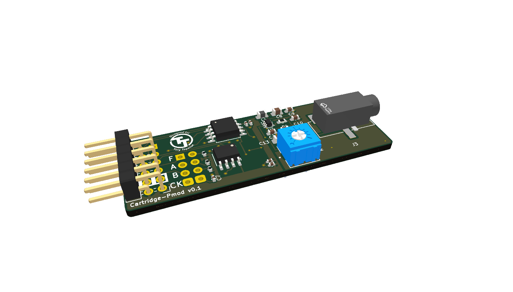
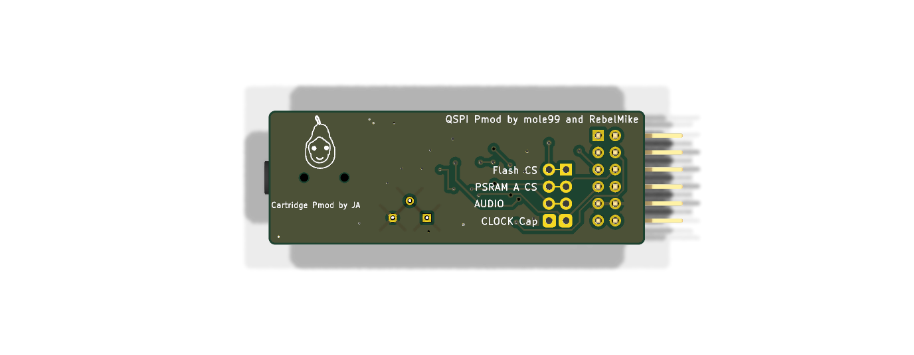
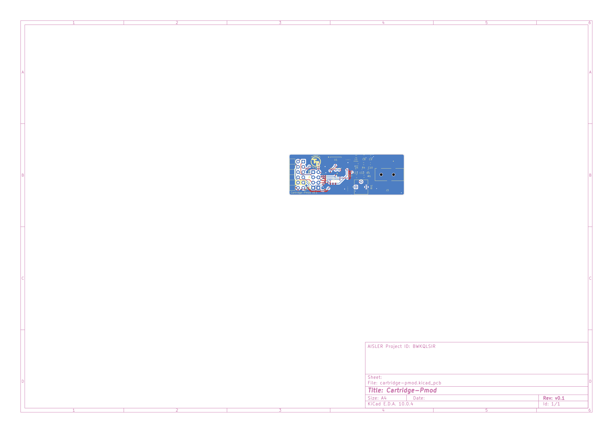
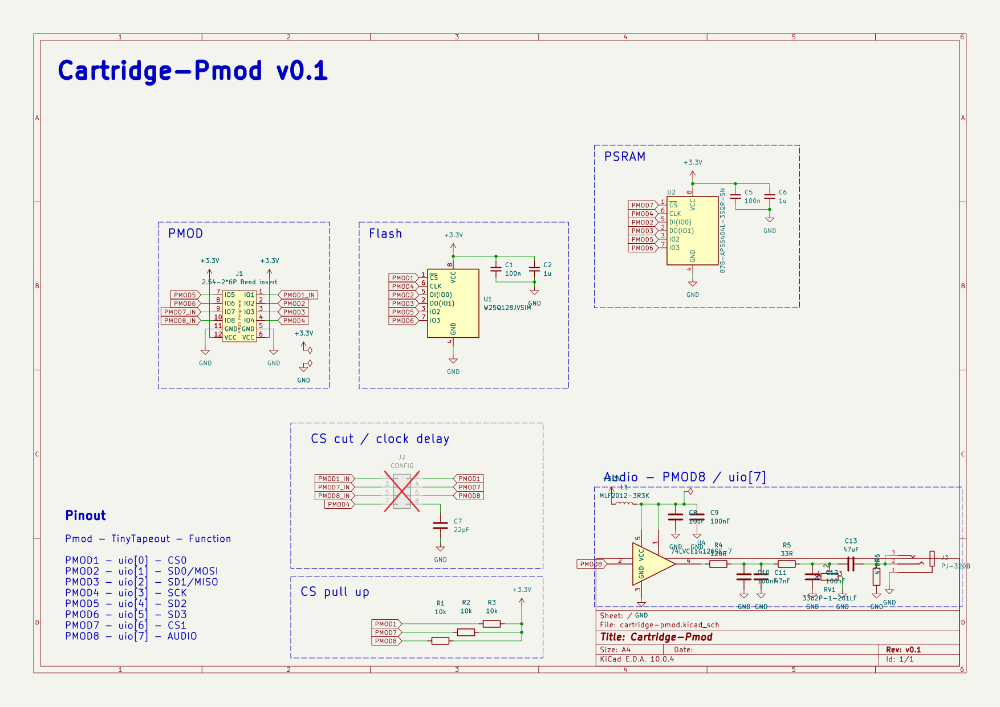

# Cartridge Pmod

QSPI memory + audio Pmod for the TinyTapeout demo board and the ULX3S console
prototype. Drop-in compatible with the stock [QSPI Pmod](https://github.com/mole99/qspi-pmod)
pinout for any flash + single-PSRAM project; PMOD8 (uio[7]) carries sigma-delta
audio out instead of the second PSRAM chip select.

**v0.1 is at the fab**: ordered from JLCPCB 2026-07-20 (5 PCBs, 2 assembled),
tag [`fab-v0.1`](../../releases/tag/fab-v0.1). A self-checking ULX3S bring-up
bitstream is ready in [`fpga/`](fpga/README.md).

| | |
|---|---|
|  |  |
|  |  |

Full-size: [schematic PDF](cartridge-pmod.pdf) ·
[layout](img/pcb_layout.png) · [schematic PNG](img/schematic.png)

Remix of two Apache-2.0 designs:
- Memory section: [mole99/qspi-pmod](https://github.com/mole99/qspi-pmod) v2.2
  (W25Q128 16 MB flash + APS6404L 8 MB PSRAM, CONFIG jumper block, CS pull-ups)
- Audio section: [MichaelBell/tt-audio-pmod](https://github.com/MichaelBell/tt-audio-pmod)
  rev 1.0 (buffer + 2-stage RC low-pass + AC-coupled 3.5 mm jack), piezo branch dropped

## Pinout

| Pmod  | TinyTapeout | Function     | Note |
|-------|-------------|--------------|------|
| PMOD1 | uio[0]      | CS0 (Flash)  | CONFIG jumper to isolate |
| PMOD2 | uio[1]      | SD0/MOSI     |      |
| PMOD3 | uio[2]      | SD1/MISO     |      |
| PMOD4 | uio[3]      | SCK          | CONFIG jumper pair adds 22 pF clock delay |
| PMOD5 | uio[4]      | SD2          |      |
| PMOD6 | uio[5]      | SD3          |      |
| PMOD7 | uio[6]      | CS1 (PSRAM)  | CONFIG jumper to isolate |
| PMOD8 | uio[7]      | AUDIO (sigma-delta / PWM in) | CONFIG jumper to isolate; ≥200 kHz carrier recommended |

## Modes

- **Console / full**: all CONFIG jumpers closed — flash + PSRAM + audio at once
  (game-console cartridge: code XIP from flash, PSRAM work RAM, audio on uio[7]).
- **Universal audio Pmod**: CS0/CS1 jumpers open — memories held in standby by
  10 k pull-ups, board is a plain audio Pmod for any project driving uio[7].
- **QSPI-compat**: audio jumper open — behaves as the stock QSPI Pmod minus
  PSRAM B (projects using only CS0/CS1 work unmodified).

## Audio chain (from tt-audio-pmod)

PMOD8 → 74LVCE1G126 buffer (ferrite-filtered 3.3 V rail, OE tied high) →
120 Ω → 100 nF‖47 nF → 33 Ω → 100 nF (2-stage RC LPF) → 200 Ω trim shunt
(volume) → 47 µF AC coupling → PJ-320B jack (tip+ring mono, 470 Ω DC
reference). Buffer input is high-impedance: audio taps the bus without
loading it.

## Status

- [x] Schematic complete, netlist machine-verified against both upstream
      designs (`tools/netlist_check.py`)
- [x] PCB layout: 56.3 × 20.1 mm, fully placed + routed (largely via pcbnew
      scripting), ERC 0 / DRC 0-unconnected, 0 silk warnings; only remaining
      DRC errors are the intentional CONFIG cut-trace feature + one upstream
      starved-thermal
- [x] Fab: **ordered at JLCPCB 2026-07-20** (tag `fab-v0.1`) — 5 PCBs,
      2 assembled (Economic, incl. the THT Pmod header), $71.76 all-in;
      see [FABRICATION.md](FABRICATION.md) for the export recipe and the
      ordering lessons (J1 rotation, PSRAM LCSC number, PCBA remark)
- [x] ULX3S bring-up harness: flash/PSRAM ID + memory test + 440 Hz test
      tone + UART report, plug orientation autodetected; simulated in both
      orientations (cocotb + icarus), 898 LUTs — see [fpga/](fpga/README.md)
- [ ] Boards arrive (~3 weeks): run the
      [first-power-up checklist](fpga/README.md#first-power-up-checklist-per-board--do-steps-1-2-before-plugging-in)

## Tools

- `tools/sch_analyze.py <file.kicad_sch>` — list all top-level elements with
  positions
- `tools/netlist_check.py [file]` — derive and print the netlist from wire
  geometry (poor man's ERC)
- `tools/build_cartridge.py` — the one-shot surgery script that generated the
  schematic from the two reference designs (kept for provenance; do not re-run)

Reference designs are vendored read-only under `refs/`.

Licensed Apache-2.0 (same as both upstream designs).
